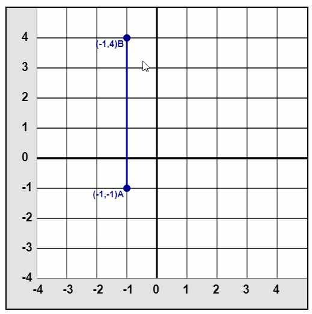

## About
A Simple HTML5 Canvas 2D Graph Demo with movable points.

[Live Demo](http://amitukind.com/projects/canvasgraph/)

1. Graph creation using canvas
2. Points Drawing
3. Points Dragging
4. Snapping to graph lines



## Usage
Run index.html in any local server or use below
```bash
npm install http-server
http-server
```

## Author
[@amitukind](https://github.com/amitukind/) | [Website](http://amitukind.com/) | [amitverma.ukind@gmail.com](mailto:amitverma.ukind@gmail.com)